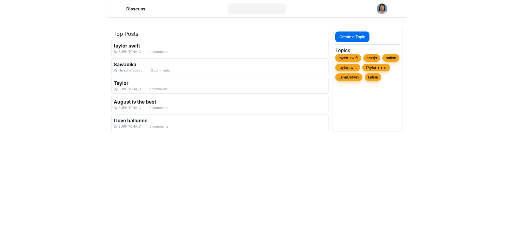
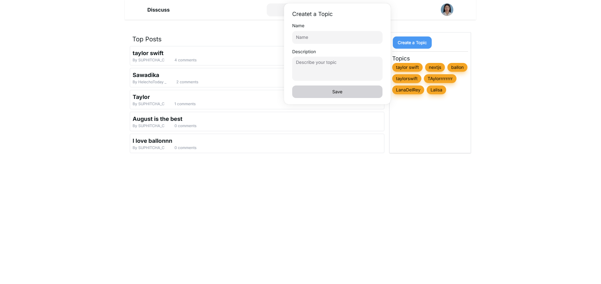
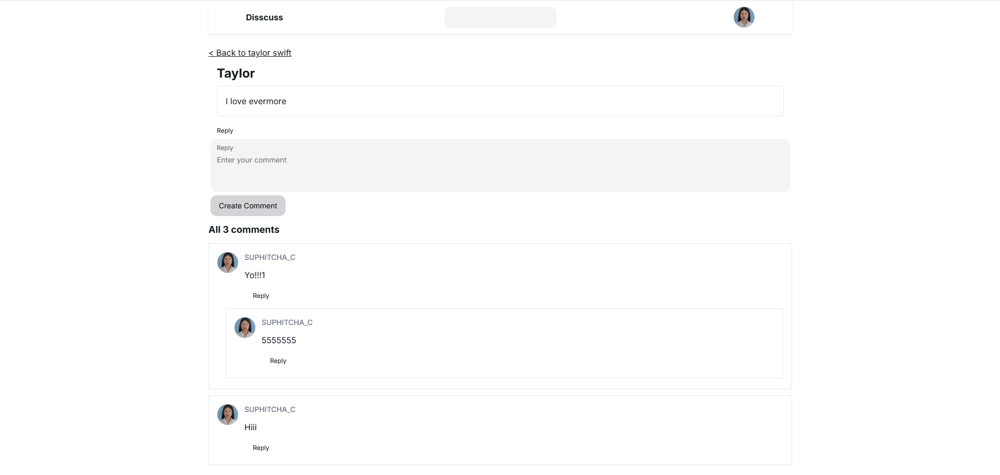
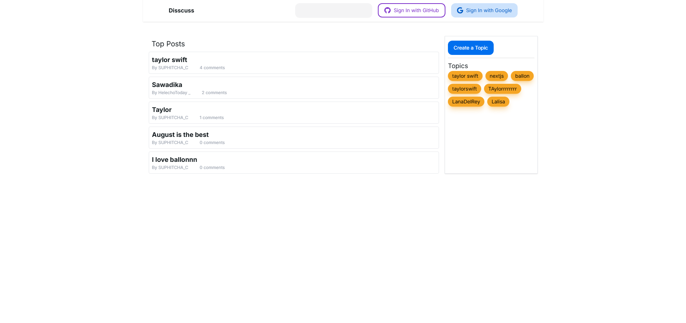
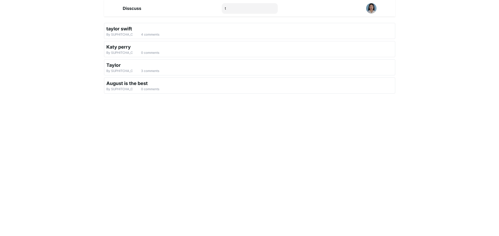
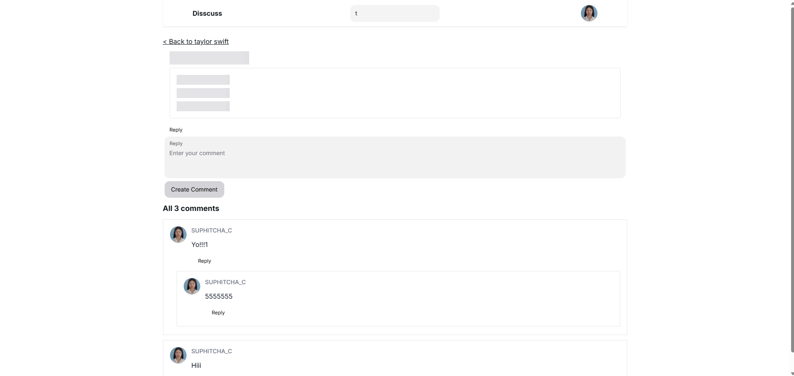

# Disscuss 💬

A full-stack discussion forum built with **Next.js 15**, **React 19**, **TypeScript**, **Prisma**, and **PostgreSQL**.

🔗 **Live demo:** [https://discuss-nf4p.vercel.app/](https://discuss-nf4p.vercel.app/)

Disscuss allows users to create discussion topics, create posts, comment on posts, and continue conversations through deeply nested replies. The application also includes OAuth authentication, post search, form validation, loading states, skeleton loading, and responsive UI.

---

## 📸 Screenshots

<!-- ใส่รูปหน้า Home / รายการ Topics ตรงนี้ -->


<!-- ใส่รูปหน้า Topic + รายการ Posts ตรงนี้ -->


<!-- ใส่รูปหน้า Post detail พร้อม Nested Comments ตรงนี้ -->


<!-- ใส่รูป popup Create Topic / Create Post ตรงนี้ -->


---

## ✨ Features

### 🔐 Authentication

Users can browse the forum without signing in, but authentication is required for actions that modify or interact with discussions.

Supported authentication providers:

- Google OAuth
- GitHub OAuth

Authentication is implemented using **NextAuth.js v5 (Auth.js)** with the Prisma adapter.

Authenticated users can:

- Create topics
- Create posts
- Create comments
- Reply to comments
- Sign out

The user's profile image is displayed after successful authentication.

<!-- ใส่รูปหน้า Sign in (ปุ่ม GitHub/Google) ตรงนี้ -->


---

### 📚 Topics

Users can create discussion topics after signing in.

Each topic contains:

- Topic name
- Topic description

Topics are displayed in the Topics section and can be selected to view posts associated with that topic.

---

### 📝 Posts

Users can create posts inside discussion topics.

Post functionality includes:

- Create a post
- View posts
- View post details
- View the number of comments
- Search posts
- Participate in discussions through comments and replies

Posts are associated with their corresponding topics and users.

---

### 💬 Comments

Authenticated users can comment on posts.

Users can:

- Create comments
- View comments
- Reply to comments
- Continue conversations through nested replies
- View the number of comments

New comments are displayed after they are successfully created.

---

### 🌳 Nested Replies

The comment system supports multiple levels of nested replies using a recursive component structure.

A conversation can continue through multiple levels:

```text
Comment
 ├── Reply
 │    ├── Reply
 │    │    ├── Reply
 │    │    │    └── Reply
 │    │    └── Reply
 │    └── Reply
 └── Reply
```

---

### 🔎 Search Posts

The application provides a search functionality for posts.

Search behavior:

- Searches posts
- Does not search topics
- Requires the user to press `Enter`
- Displays matching posts after submitting the search

<!-- ใส่รูปหน้า Search results ตรงนี้ -->


---

### ⏳ Loading & Skeleton UI

The application uses loading states, **React Suspense**, and skeleton components to provide feedback while asynchronous data is being fetched or processed.

`useActionState` is also used to manage form action state, validation errors, action results, and pending states.

<!-- ใส่รูปหน้า Skeleton loading ตรงนี้ -->


---

### 🛡️ Protected Actions

Unauthenticated users can browse public content, but must sign in before they can:

- Create a topic
- Create a post
- Create a comment
- Reply to a comment

Server-side authentication checks are performed before protected mutations.

---

# 🏗️ Architecture

The application separates UI, server-side mutations, database queries, and database access.

```text
┌────────────────────────────────────────────┐
│          UI / Client Components            │
│                                            │
│     React + NextUI + Tailwind CSS          │
└──────────────────────┬─────────────────────┘
                       │
                       │ Form Action
                       ▼
┌────────────────────────────────────────────┐
│              Server Actions                │
│                                            │
│  Zod Validation                            │
│        ↓                                   │
│  Authentication Check                      │
│        ↓                                   │
│  Prisma Mutation                           │
│        ↓                                   │
│  revalidatePath / redirect                 │
└──────────────────────┬─────────────────────┘
                       │
                       ▼
┌────────────────────────────────────────────┐
│              Prisma ORM                    │
└──────────────────────┬─────────────────────┘
                       │
                       ▼
┌────────────────────────────────────────────┐
│           PostgreSQL Database              │
│                  Neon                      │
└────────────────────────────────────────────┘
```

---

## 📂 Project Structure

```text
Disscuss/
│
├── actions/
│   ├── Authentication actions
│   ├── Topic actions
│   ├── Post actions
│   ├── Comment actions
│   └── Search actions
│
├── db/
│   └── queries/
│       └── Database read operations
│
├── components/
│   ├── UI components
│   ├── Forms
│   ├── Comments
│   ├── Posts
│   ├── Topics
│   └── Loading / Skeleton components
│
├── app/
│   ├── page.tsx
│   ├── route.ts
│   └── Application routes
│
├── paths.ts
│   └── Centralized URL helpers
│
├── prisma/
│   └── schema.prisma
│
├── public/
│   ├── screenshots/
│   │   ├── home.png
│   │   ├── topic.png
│   │   ├── post-comments.png
│   │   ├── create-topic.png
│   │   ├── sign-in.png
│   │   ├── search.png
│   │   └── skeleton.png
│   └── Static assets
│
├── package.json
├── tsconfig.json
├── next.config.*
├── tailwind.config.*
└── README.md
```

---

# 🛠️ Tech Stack

## Framework & Frontend

- **Next.js 15** — App Router
- **React 19**
- **TypeScript**
- **Tailwind CSS**

## UI Libraries

### NextUI

Used for reusable UI components such as:

- Navbar
- Button
- Input
- Textarea
- Popover
- Chip
- Avatar
- Skeleton

### react-icons

Used for interface icons including GitHub and Google icons.

---

## React Hooks & Features

- `useState` — local component state
- `useRef` — DOM references and persistent mutable values
- `useEffect` — client-side effects
- `useActionState` — form state, errors, results, and pending states
- `Suspense` — asynchronous UI rendering and streaming
- `cache()` — deduplicate database queries within the same request

---

# ⚡ Next.js Features

The application uses:

- App Router
- Server Components
- Client Components
- Server Actions
- Dynamic Routes
- `redirect()`
- `notFound()`
- `useSearchParams()`
- `next/link`
- `next/image`
- `revalidatePath()`

Server Actions are used for operations such as:

- Creating topics
- Creating posts
- Creating comments
- Searching posts
- Signing in
- Signing out

---

# 🔑 Authentication

Authentication is implemented using:

- **NextAuth.js v5 (Auth.js)**
- **@auth/prisma-adapter**
- Google OAuth
- GitHub OAuth

### Server

```typescript
auth()
```

is used for server-side authentication checks.

### Client

```typescript
useSession()
```

is used when session information is required on the client.

### Authentication Flow

```text
User
 │
 ├───────────────┐
 │               │
 ▼               ▼
Google          GitHub
 │               │
 └───────┬───────┘
         ▼
      Auth.js
         │
         ▼
   User Session
         │
         ▼
Authenticated User
```

---

# 🗄️ Database

The application uses **PostgreSQL** as its relational database.

**Prisma ORM** is used as the database access layer.

The PostgreSQL database is hosted using **Neon**.

```text
Next.js
   │
   ▼
Prisma Client
   │
   ▼
PostgreSQL
   │
   ▼
Neon
```

## Prisma Models

The main database models include:

- `User`
- `Post`
- `Topic`
- `Comment`

The models contain relationships between users, topics, posts, comments, and nested replies.

The application also uses Prisma relation counts through:

```typescript
_count
```

for information such as comment counts.

---

# ✅ Validation

Form data submitted to Server Actions is validated using **Zod**.

```text
Form Data
    │
    ▼
Zod Validation
    │
    ├── Invalid
    │      │
    │      ▼
    │    Return Error
    │
    └── Valid
           │
           ▼
      Authentication
           │
           ▼
      Prisma Mutation
```

Zod ensures that submitted data follows the expected structure before database mutations are performed.

---

# 🔄 Server Action Flow

Mutations follow a consistent server-side workflow:

```text
User submits form
        │
        ▼
   Server Action
        │
        ▼
  Zod Validation
        │
        ▼
 Authentication Check
        │
        ▼
 Prisma Database Mutation
        │
        ▼
  revalidatePath()
        │
        ▼
      redirect()
```

---

# 💬 Comment Architecture

Comments support recursive nesting.

```text
Post
 │
 ├── Comment
 │    ├── Reply
 │    │    ├── Reply
 │    │    │    └── Reply
 │    │    └── Reply
 │    │
 │    └── Reply
 │
 └── Comment
      └── Reply
```

The UI uses a recursive component structure to render replies regardless of nesting depth.

---

# ⏱️ Data Fetching & Streaming

The application uses server-side data fetching together with React Suspense.

```text
Page Request
     │
     ▼
Server Component
     │
     ▼
Data Query
     │
     ├───────────────┐
     │               │
     ▼               ▼
  Loading         Data Ready
     │               │
     ▼               ▼
 Skeleton UI      Real Content
     │               │
     └───────┬───────┘
             ▼
          Render
```

`Suspense` allows parts of the UI to render progressively while asynchronous data is being loaded.

---

# 📊 Data Relationship

```text
User
 │
 ├───────────────┐
 │               │
 ▼               ▼
Topic           Post
 │               │
 │               ▼
 └──────────────►Comment
                     │
                     ▼
                   Reply
                     │
                     ▼
                Nested Reply
```

A topic can contain multiple posts.

A post can contain multiple comments.

A comment can contain multiple replies.

Replies can themselves contain additional replies.

---

# 📌 Main Concepts Practiced

This project was built to practice modern full-stack web development concepts, including:

- Next.js 15
- App Router
- React 19
- TypeScript
- Server Components
- Client Components
- Server Actions
- Authentication
- OAuth
- Protected actions
- Dynamic routing
- Database integration
- Prisma ORM
- PostgreSQL
- Prisma relations
- Prisma `_count`
- Form validation
- Zod
- React hooks
- `useActionState`
- React Suspense
- Streaming UI
- Skeleton loading
- Loading states
- Search functionality
- Recursive components
- Nested comments
- Nested replies
- Cache deduplication with `cache()`
- Path revalidation
- Responsive UI
- Tailwind CSS
- Component-based UI development
- Cloud database hosting
- Web application deployment

---

# 🚀 Getting Started

## 1. Clone the repository

```bash
git clone https://github.com/Suphitcha03/Discuss.git
cd Discuss
```

## 2. Install dependencies

```bash
npm install
```

## 3. Configure environment variables

Create a `.env.local` file in the root directory.

The application requires environment variables for:

- Auth.js / NextAuth
- Google OAuth
- GitHub OAuth
- PostgreSQL / Neon
- Prisma

Example:

```env
DATABASE_URL="your_database_url"

AUTH_SECRET="your_auth_secret"

AUTH_GITHUB_ID="your_github_client_id"
AUTH_GITHUB_SECRET="your_github_client_secret"

AUTH_GOOGLE_ID="your_google_client_id"
AUTH_GOOGLE_SECRET="your_google_client_secret"
```

> Environment variable names may differ depending on the project's current configuration.

## 4. Set up Prisma

Generate the Prisma Client:

```bash
npx prisma generate
```

Run database migrations:

```bash
npx prisma migrate dev
```

## 5. Run the development server

```bash
npm run dev
```

Open:

```text
http://localhost:3000
```

---

# 🌐 Deployment

The application is deployed using **Vercel**.

The PostgreSQL database is hosted using **Neon**.

🔗 **Live app:** [https://discuss-nf4p.vercel.app/](https://discuss-nf4p.vercel.app/)

```text
GitHub
   │
   ▼
Vercel
   │
   ▼
Next.js 15
   │
   ▼
Prisma
   │
   ▼
Neon PostgreSQL
```

---

# 🔗 Repository

**GitHub Repository**

https://github.com/Suphitcha03/Discuss

**Live Demo**

https://discuss-nf4p.vercel.app/

---

# 🔮 Future Improvements

Possible improvements for future versions include:

- Edit posts
- Delete posts
- Edit comments
- Delete comments
- User profile pages
- Like / reaction system
- Notifications for replies
- Pagination
- Infinite scrolling
- Advanced search and filtering
- Image uploads
- Improved mobile experience

---

# 💡 What I Learned

Building Disscuss provided hands-on experience with full-stack development using the modern Next.js App Router architecture.

The project helped develop an understanding of:

- Building applications with Next.js Server Components
- Using Client Components when client-side interaction is required
- Creating Server Actions for database mutations
- Validating form data with Zod
- Protecting server-side actions with authentication
- Integrating OAuth authentication
- Connecting Prisma with PostgreSQL
- Working with relational database models
- Handling nested relational data
- Building recursive components
- Implementing deeply nested comments and replies
- Using React Suspense for asynchronous UI
- Creating skeleton loading states
- Managing form state with `useActionState`
- Implementing post search
- Revalidating pages after mutations
- Structuring a full-stack application into separate layers

One of the main challenges of the project was designing the nested comment system.

Because comments can contain replies and replies can contain additional replies, the UI uses a recursive component structure to render the discussion hierarchy.

Another important part of the project was combining Server Actions, Zod validation, authentication checks, Prisma mutations, and cache revalidation into a consistent server-side workflow.

---

# 👩‍💻 Author

**SUPHITCHA_C**

Built with:

**Next.js 15 · React 19 · TypeScript · Prisma · PostgreSQL · Auth.js · Zod · NextUI · Tailwind CSS**